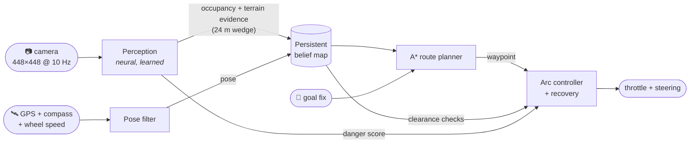
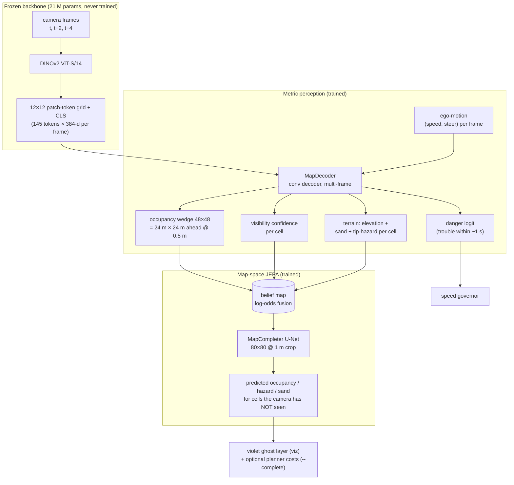
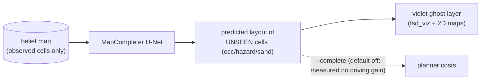
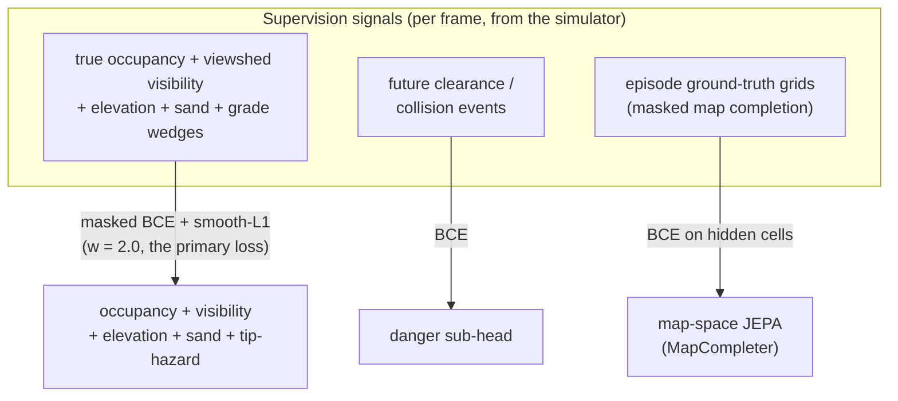
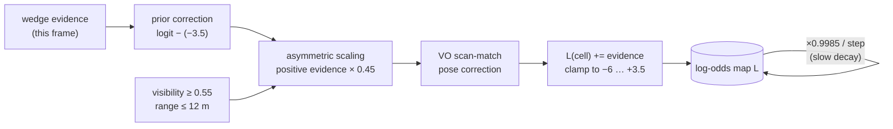
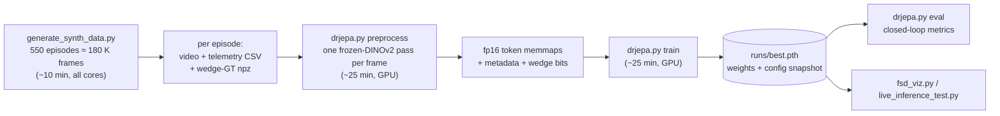

# DR-JEPA v12: Camera + Goal-Vector Autonomous Rover Navigation

DR-JEPA drives a rover to a GPS goal using **one forward camera and a goal
vector — nothing else**. No lidar, no depth sensor, no prior map.

It is not an end-to-end "pixels in, steering out" black box, and it is not
an action mimic. The core idea is that the model **builds an explicit,
persistent model of the world in its head** and navigation happens *on that
mental model*:

1. **Perceive** — a neural network converts each camera frame into metric
   evidence: *"which patches of ground in front of me are blocked?"*
2. **Remember** — that evidence is fused into a persistent bird's-eye map
   that covers the entire run and never forgets. An obstacle seen once
   stays known after it leaves the camera view.
3. **Plan** — a route to the goal is computed on the believed map and
   re-planned continuously as new evidence arrives.
4. **Act** — a local controller tracks the route, checking every candidate
   motion against the map, with recovery behaviors when boxed in.



**Headline results** (closed loop, 108 unseen randomized worlds with
full terrain hazards — washes, steep grades, soft sand — plus rocks /
forests / walls / boulder fields, ~40–150 m goals):

| policy | success | tip-overs | SPL¹ | contact events/ep |
|---|---:|---:|---:|---:|
| privileged expert (sees true obstacles *and* terrain) | 97.2% | 0.9% | 0.92 | 0.46 |
| **DR-JEPA (camera + goal vector only)** | **87.0%** | 9.3% | **0.75** | **1.31** |

¹ *SPL = success weighted by (straight-line distance / actual path length);
1.0 means every goal reached by a perfect path.*

On the older flat worlds (obstacles only, no terrain physics) the same
architecture scores 100% success / SPL 0.89 — the current numbers are
lower because the *world got harder*, not the model worse: tip-over is
terminal, washes must be perceived from monocular shading, and the naive
behavior-cloning baseline (v7) never exceeded 62.5% success even on the
easy worlds.

Inference is **~8 ms per control step (~120 Hz)** on an RTX 4080 — 12×
faster than the 10 Hz control loop needs. **~2.8 M trainable parameters** on top
of a frozen DINOv2 backbone.

---

## Table of contents

- [How the model thinks](#how-the-model-thinks)
- [The architecture, piece by piece](#the-architecture-piece-by-piece)
- [What the model learns (training objectives)](#what-the-model-learns-training-objectives)
- [How the world is remembered (the belief map)](#how-the-world-is-remembered-the-belief-map)
- [How the actor drives](#how-the-actor-drives)
- [Why the danger score exists (and what it is now)](#why-the-danger-score-exists-and-what-it-is-now)
- [The synthetic world and the expert teacher](#the-synthetic-world-and-the-expert-teacher)
- [Results in detail](#results-in-detail)
- [Quickstart](#quickstart)
- [Visualizations](#visualizations)
- [Configuration](#configuration)
- [Repository layout](#repository-layout)
- [Design history: what failed and why this design won](#design-history-what-failed-and-why-this-design-won)
- [Moving to real data](#moving-to-real-data)

---

## How the model thinks

A reactive policy (camera → action) has a fatal flaw for navigation: **the
moment an obstacle leaves the field of view it stops existing.** Such a
policy circles, re-explores, and drives into things it saw two seconds ago.
Our earlier behavior-cloning version did exactly that (62.5% success).

DR-JEPA instead separates *understanding* from *acting*:

- **Understanding is learned.** The hard, camera-specific problem —
  "convert pixels into metric geometry" — is solved by a neural network
  with dense supervision. This is where deep learning earns its keep.
- **Memory is exact.** Fusing geometry over time is a solved probability
  problem (Bayesian occupancy mapping), so it is done with math, not a
  network. The map cannot drift, collapse, or forget the way a recurrent
  latent state can, and it is unbounded: a 10-minute run costs the same
  per step as a 10-second one.
- **Acting is planned.** Given a believed map, finding a route is search
  (A*), not learning. The planner is *the same algorithm* the privileged
  expert uses on ground truth — so as perception approaches perfection,
  navigation provably approaches the expert's 100%.

This is why the system stopped hitting things: the ceiling of a plan-on-map
navigator is the quality of the map, not the compounding of per-step action
errors.

Every pixel of the [FSD-style visualization](#visualizations) is rendered
from this internal belief — the boxes, the free space, the route — never
from simulator ground truth. If a box appears there, it is because the
network put it in the map.

---

## The architecture, piece by piece



### Frozen DINOv2 backbone — *the sim-to-real anchor*

Every frame passes through DINOv2 ViT-S/14, a vision transformer pretrained
by Meta on 142 M real images. It is **completely frozen**, for two reasons:

1. **Transfer.** Its features already describe real-world texture, depth
   cues, and object boundaries. Everything trainable sits *behind* these
   features, so a model trained on synthetic renders stays anchored to a
   representation that works on real footage.
2. **Speed.** Frozen backbone ⇒ features can be precomputed once during
   dataset packing. Training then never touches pixels and a full training
   run takes ~25 minutes on one GPU.

The 32×32 patch grid (448 px input) is average-pooled to **12×12 + CLS =
145 tokens** per frame — fine enough for metric geometry, small enough to
store (fp16 memmaps).

### MapDecoder — *the eyes*

The perception head answers, for each 0.5 m cell in the 24 m × 24 m area
ahead: *is it blocked, can I see it, how high is it, is it soft sand, and
is it steep enough to tip me?* — five channels (occupancy, visibility,
elevation, sand, steep-ground hazard). Three design details matter:

- **Multi-frame input with ego-motion.** The decoder sees the tokens of
  frames *t, t−2, t−4* stacked per grid position, plus each frame's speed
  and steering. Three views of the same rock from slightly different
  positions give **motion parallax** — the strongest monocular depth cue —
  so ranging does not rely on texture size alone.
- **A visibility head.** The network also predicts *which cells it can
  actually see* (the field-of-view cone minus occlusion shadows). It is
  trained with occlusion-aware raycast masks, so it is never punished for
  not knowing what is behind a rock — and at fusion time, low-confidence
  cells simply do not write into the map. This keeps the map free of
  hallucinated geometry.

- **A directly-supervised steep-ground channel.** Tip-over hazard is
  *classified from visual cues* (bank shading, texture compression at a
  wash lip), with labels ramping over true grade 0.38 → 0.50 (the tip
  threshold). Two obvious-looking alternatives are documented dead ends:
  gradients of the *fused* elevation map contain pose-drift seams that
  build phantom lethal walls, and gradients of the *predicted* per-wedge
  elevation carry no steepness signal at all — regression smooths banks
  flat (measured: true 0.5-grade banks scored *lower* predicted gradients
  than mild slopes). If you need "will this terrain kill me," you must
  supervise it as its own output.

Output orientation matters more than it looks: the conv output is re-indexed
(flip + transpose) so image axes map *locally* onto wedge axes. Conv kernels
can learn a perspective warp; they cannot learn a global transpose — this
single bug once held occupancy IoU at 0.06.

### The temporal JEPA that used to live here — and why it's gone

Earlier versions carried a second branch: a FrameEncoder + causal
transformer producing a belief embedding, with an action-conditioned JEPA
predictor (EMA target encoder, VICReg anti-collapse) and BC policy /
future-danger / progress heads on top. It was the project's original
namesake. Once the map pilot became the driver, its only inference-time
output was the danger scalar — and two measurements sealed the verdict:
disabling the learned danger cap changed closed-loop results by ~nothing
(success and tips identical, SPL +0.007), and a small danger head on the
perception trunk matches it without the branch's ~2.5 M parameters and
per-step transformer forward. The whole branch — plus the BC pilot that
rode on it — was removed. Cost: −59% trainable parameters, faster steps,
and a model where every component has a measured reason to exist. The
JEPA that survives is the one predicting the world model itself:

### MapCompleter — *map-space JEPA, the map's imagination*

The second JEPA works on the belief map instead of the embedding space:
mask what the rover hasn't seen, predict it from what it has — I-JEPA's
recipe applied to the map. Given an 80 m × 80 m crop of the belief
(observed occupancy, hazard, sand + the observed mask), a small U-Net
predicts those three channels for the **hidden** cells: walls tend to
continue, washes keep their course, open ground stays open.



It is trained on masked ground-truth grids, then **fine-tuned on real
belief maps** logged from closed-loop runs (`collect_beliefs` →
`tune_completer`, with per-channel temperature calibration), scoring
hidden-cell AUC ≈ 0.67–0.71 on held-out real beliefs. That is genuine
world-layout prediction — you can watch it sketch violet guesses into
unexplored space and have the camera confirm or dissolve them. What it is
*not*, yet, is a driving improvement: every planner integration tested
measured at-or-below baseline (see
[Results](#map-space-jepa-completion-what-we-measured-honestly)), so its
shipping roles are visualization, analysis, and a trained foundation for
future uncertainty-aware planning.

### The heads

| head | input | output | role at inference |
|---|---|---|---|
| MapDecoder | frame tokens ×3 + ego-motion | occ + vis + elev + sand + hazard wedge | **builds the map — primary** |
| — danger sub-head | MapDecoder trunk features + ego-motion | p(trouble within ~1 s) | speed-cap telemetry |
| MapCompleter | belief-map crop + observed mask | predicted layout of unseen cells | ghost viz; planner via `--complete` |

That is the whole model: one perception network with a danger sub-head,
one map completer. Earlier versions carried four more heads (BC policy,
future-danger, progress, plus the JEPA predictor they hung off) — see the
design-history section for the measurements that retired them.

---

## What the model learns (training objectives)

Everything trains jointly, from data logged by a scripted expert driving
in the simulator (next section). One batch = windows of 20 consecutive
frames.



Details that matter:

- **Occupancy loss is masked by visibility** and weighted toward near rows
  (1.6× at 0 m fading to 0.7× at 16 m); cells beyond 16 m are not
  supervised at all — monocular ranging past that is noise, and training on
  noise pollutes calibration. The map accumulates the far field naturally
  as the rover approaches.
- **Checkpoint selection uses the perception losses only** (wedge +
  completion): perception quality is what drives navigation; the danger
  sub-head is reported but does not vote.
- Occupancy positive class weight is mild (1.5): fusion handles the base
  rate (below), and inflating positives fattens the false-positive tail
  that pollutes maps.

---

## How the world is remembered (the belief map)

The rover's long-term memory is a **512×512-cell log-odds occupancy grid**
(0.5 m cells ≈ 256 m × 256 m), anchored to the world frame, re-centering
itself if the rover drives near its edge. It is the "ever-growing, permanent
context": O(1) cost per step, unlimited duration.



Each stage exists because a failure mode demanded it:

- **Prior correction** — occupancy's base rate is ~2%, so a *calibrated*
  network's decision boundary sits at logit ≈ −3.5, not 0. A prediction of
  p = 0.3 is *ten times the base rate* — strong evidence FOR an obstacle —
  yet naive fusion (`L += logit`) would count it as evidence of free space.
  Bayesian updating subtracts the prior: `evidence = logit − prior`. Fixing
  this took closed-loop success from 75% → 100%.
- **Asymmetric scaling + decay + positive clamp** — per-frame false
  positives are *correlated* (a terrain ridge misread once is misread every
  frame), which breaks naive fusion's independence assumption and once
  grew phantom walls until worlds looked sealed shut. Positive evidence
  accumulates slower than free-space evidence, phantom mass decays
  (~46 s half-life) unless re-confirmed, and occupied belief saturates
  below free belief so it stays revisable.
- **Visual-odometry alignment** — GPS drifts, so a wedge painted now can
  land ~1 m off the same obstacle painted a minute ago, smearing the map.
  Before fusing, the new wedge is scan-matched (±1 m search) against
  already-established map structure, and the residual nudges the pose
  filter. GPS still anchors the absolute frame; VO removes the relative
  drift *between* observations. (`--no_vo` disables it.)
- **The fresh-wedge guard** — the newest wedge is in the rover's own frame
  and therefore immune to pose error. The controller checks arcs against
  *both* the fused map and this zero-lag near-field guard.
- **Range-gated hazard fusion** — the terrain-hazard channel fuses with the
  same prior-correction recipe (own prior ≈ −2.2) plus one extra rule:
  positive hazard evidence is attenuated with distance (×1 within 4 m,
  ×0.5 to 8 m, ×0.25 beyond). Measured flat-ground false-positive rates
  rise from 2% near to 10% at the 8–12 m rows, and without the gate that
  far tail floods the map with phantom lethal terrain and times episodes
  out. Negative (safe) evidence fuses at full strength from any range, and
  a low positive cap (+2.0) lets later clean views wash phantoms out fast.

Pose itself comes from a complementary filter: integrate wheel-speed ×
compass heading for smooth short-term motion, pull gently toward GPS
(gain 0.08/step) to bound long-term drift.

---

## How the actor drives

Every 100 ms control step:


- **The global planner** runs weighted A* over a costmap derived from the
  map: cost rises smoothly with occupancy probability and with proximity to
  believed obstacles (distance-transform inflation); unknown space costs
  slightly more than known-free (mild exploration preference); cells within
  ~0.9 m of believed obstacles are lethal. If the map claims *no* route
  exists, the planner retries with a slimmer lethal radius — the map can be
  wrong; the planner must not deadlock.
- **The local controller** is the same arc-sampling recipe the privileged
  expert uses — 17 constant-curvature arcs, scored by waypoint progress,
  clearance, heading alignment, and steering smoothness — except every
  clearance lookup goes through the *believed* map instead of ground truth.
- **Creep mode** resolves a deadlock the two layers can create: in a tight
  gap the conservative arc check may reject everything while A* correctly
  insists the corridor is passable. Instead of thrashing into recovery, the
  rover creeps along the route at low speed; genuine stuck-ness (no motion
  while commanding forward) still triggers recovery.
- **Recovery** mirrors the expert: reverse toward the more open side; if
  reversing is also blocked, alternate with a slow forward escape turn.
- **The throttle governor** takes the *minimum* of several caps: arc
  clearance, turn sharpness, goal proximity, gap width ahead (from the
  fresh wedge — tight gaps are threaded slowly, because with 200 ms
  actuation latency, speed is what turns a near-miss into a graze), and the
  learned danger score.

---

## Why the danger score exists (and what it is now)

The danger score is a *learned reflex*: p(clearance collapse or contact
within ~1 s), predicted by a small sub-head on the perception trunk from
the same multi-frame, ego-motion-conditioned features that build the
wedge.

Full honesty about its measured value: with the v13 model, **disabling
the danger speed-cap changed closed-loop results by approximately
nothing** (success and tips identical, SPL +0.007) — the analytic
governors in the controller (arc clearance, gap width, sand, hazard-arc
checks) already cover what it was catching in sim. It survives in this
slimmed form because it is nearly free (~0.6 M params inside the decoder,
no extra forward pass), it powers the HAZARD bar and red vignette in
every visualization, and on the real rover an outcome-calibrated
"this looks like trouble" signal is a tuning knob we expect to want when
the analytic governors' constants meet real dust and real latency. Its
predecessor — a dedicated temporal branch with a causal transformer and
JEPA-predictor siblings — was removed when measurement showed this small
head matches its driving value at a fraction of the cost.

---

## The synthetic world and the expert teacher

Training data comes from a domain-randomized simulator
(`drjepa/simulator.py`) engineered so that *nothing the model relies on is
sim-specific*:

- **Geometry & terrain hazards:** gridded heightfield with rolling relief,
  **carved washes/gullies** (steep, often un-climbable banks), **steep
  mounds**, and **sand fields** that visually recolor the ground and
  physically sap traction. Camera pitch/roll follows the ground. Crossing
  too steep a side-slope tips the rover (terminal); grades past the climb
  limit stall it. Irregular jittered-mesh rocks/trees/bushes, four scenario
  types (open scatter, dense forest, walls with gaps, boulder fields) plus
  u-turn and stuck-recovery spawns. A **drive-over rule** keeps small
  debris honest: rocks under 0.25 m and shrubs under 0.45 m render normally
  but carry no hitbox, no GT occupancy, and no expert avoidance — a real
  rover rolls straight over curb-sized rocks, and pebbles too small for
  DINOv2 features to resolve must not be labeled as obstacles the model
  gets punished for missing.
- **Appearance randomized per episode:** sun direction and intensity, sky
  palette, ground/rock/vegetation palettes, fog density, exposure and
  white-balance, vignette, sensor noise, motion blur, ride-bump camera
  shake.
- **Physics:** acceleration limits, steering lag, 200 ms actuation latency,
  wheel slip, and contact with **tangential sliding** (a rover wedged
  against a rock scrapes past it rather than freezing — without this,
  wedges between boulders were unescapable).
- **Sensors:** the logs contain only what a real rover would have — GPS
  with bounded random-walk bias, compass with bias + noise, noisy wheel
  speed. Ground truth (true pose, occupancy wedges with raycast visibility)
  is logged *separately, for training labels only*.

The **teacher** is a privileged two-layer autonomy stack: A* over the true
obstacle map + the arc controller (`drjepa/expert.py`). It scores ~98%
success / SPL 0.94 and provides clean action labels. During logging, the
*executed* commands are occasionally noise-perturbed while labels stay
clean, so the dataset covers off-route states with corrective supervision.
`--scenario` forces one scenario type; `--dagger ckpt` makes the *model*
drive while the expert labels (DAgger).



---

## Results in detail

### v11: terrain-hazard worlds, full matrix

The current evaluation world is the hardest yet: carved washes with
un-climbable banks, steep mounds, traction-sapping sand, terminal
tip-over physics, drive-over debris, and all four obstacle scenarios.
Pooled over 3 seed blocks × 36 unseen episodes per arm (block 7000 fully
held out):

| arm | success | tip-overs | SPL | contacts/ep |
|---|---:|---:|---:|---:|
| privileged expert | 97.2% | 0.9% | 0.922 | 0.46 |
| **DR-JEPA (shipping config)** | **88.9%** | 8.3% | 0.714 | 0.90 |
| + completion in planner (invite-only) | 86.1% | 10.2% | 0.715 | 0.90 |
| + completion speed governor | 86.1% | 9.3% | 0.704 | 0.85 |
| + both | 86.1% | 10.2% | 0.714 | 0.94 |

Milestones inside these numbers:

- **Contacts fell ~3×** vs v10 (2.1 → 0.9 per episode). Two causes: the
  drive-over rule (a long-standing bug gave "non-colliding" ground clutter
  live hitboxes — the rover kept getting stuck on pebbles perception
  cannot even resolve), and cleaner occupancy labels once those pebbles
  left the GT.
- **Perception now sees what kills the rover.** Elevation ~4 cm mean
  error, near-perfect sand, and a supervised steep-ground channel with a
  measured 5.7-logit separation between flat ground and tip-grade banks.
  The residual 8% tips happen on *observed but marginal* terrain — cells
  straddling the 0.45–0.55 grade band where monocular grade estimation
  runs out of precision — not on unseen hazards.
- **Even the expert fails ~3%** here: these worlds are legitimately hard.

### v12: subtraction by measurement (the shipping model)

v12 removed the temporal/embedding JEPA branch and the BC pilot entirely
(see the architecture and design-history sections for why) and moved the
danger score onto the perception trunk. The trade, measured over the same
3 x 36-episode blocks and two independent training seeds:

| | v11 (6.9 M params) | v12 (2.8 M params) |
|---|---:|---:|
| success | 88.9% | 87.0% |
| tip-overs | 8.3% | 9.3% |
| SPL | 0.714 | 0.753 |
| contacts / episode | 0.90 | 1.31 |
| latency / step | ~12 ms | ~8 ms |

Success, tips, and SPL sit within seed noise (each delta is 1-2 episodes
of 108; the second v12 seed reproduces the same band). The one real cost
is the contact tail: ~+0.3-0.4 grazes per episode, concentrated in a few
wall-scraping episodes, consistent across both v12 seeds. The learned
danger cap itself measured ~zero closed-loop value (disabling it on v11:
success and tips identical, SPL +0.007), so the regression traces to
training-dynamics texture rather than the removed branch's runtime
output. We took the trade: -59% parameters, one perception trunk, every
surviving component measured.

### Map-space JEPA (completion): what we measured, honestly

The MapCompleter genuinely anticipates hidden map content — after
fine-tuning on *real* fused belief maps (not synthetic masks) and
per-channel temperature calibration, it scores hidden-cell **AUC ~0.67
(occupancy) / 0.56-0.71 (hazard, run-dependent)** on held-out real
beliefs, and it drives
the violet ghost layer in the visualizers. Making it *drive better*,
however, failed a rigorous eval gate — twice, across two model
generations and five integration schemes:

1. *Raw cost-shaping* (v10): predictions raise unknown-space costs →
   anti-exploratory; the wall-continuation prior paints over the very gap
   the rover should probe. −3 pts success.
2. *Invite-only costs* (v11): predictions can only make confident-open
   unknown space cheaper, never forbid — the theoretical fix for the
   anti-exploratory failure. Measured −2.8 pts success anyway: acting on
   an AUC-0.7 prior in a static field loses to patient observation.
3. *Predicted-hazard speed governor* (v11): slow down before predicted
   unseen hazards. Near-field arcs are almost always already observed
   (measured: the arc-based version fired **zero** times in 108
   episodes), and sim tip-overs are speed-independent geometry, so even
   the path-targeted version cannot buy safety.

Planner integration therefore defaults **OFF** (`--complete` to enable —
the full training/tuning pipeline for it stays in the repo:
`collect_beliefs` → `tune_completer`). The honest takeaway: at URC-scale
static fields, a 0.7-AUC map prior is a good *visualization and analysis*
signal but not yet a *driving* signal; the promising direction remains
planning on prediction *uncertainty* (information gain), not predicted
cost.

### Flat-world reference (obstacles only, v9-era sim)

| metric | expert (privileged) | DR-JEPA | BC pilot (v7 architecture, since removed) |
|---|---:|---:|---:|
| success rate | 96.7% | **100%** | 62.5% |
| SPL | 0.94 | **0.889** | 0.44 |
| contact events / episode | 0.23 | **1.87** | 6.5 |

---

## Quickstart

```bash
python3.12 -m venv .venv
.venv/bin/pip install torch torchvision opencv-python pandas numpy tqdm
source .venv/bin/activate
```

```bash
# 1 · generate the dataset (video + telemetry + wedge ground truth)
python generate_synth_data.py --episodes 400 --output data_v11
python generate_synth_data.py --episodes 150 --output data_v11_wall --scenario wall --seed 50000

# 2 · pack: run every frame through frozen DINOv2 once
python drjepa.py preprocess --data_dir data_v11,data_v11_wall --output packed

# 3 · train
python drjepa.py train --dataset packed --save_dir runs

# 4 · (optional) fine-tune + calibrate the map completer on REAL belief maps
python drjepa.py collect_beliefs --checkpoint runs/best.pth --episodes 240 --output belief_data
python drjepa.py tune_completer --checkpoint runs/best.pth --belief_dir belief_data --out runs/best.pth

# 5 · closed-loop evaluation (records show the live belief map + route)
python drjepa.py eval --policy model --checkpoint runs/best.pth --episodes 40 --record 4
python drjepa.py eval --policy expert --episodes 40          # privileged upper bound
python drjepa.py eval ... --no_vo                            # VO ablation
python drjepa.py eval ... --complete                         # completion in the planner

# 6 · watch it drive
python live_inference_test.py --checkpoint runs/best.pth     # endless run + HUD
python fsd_viz.py --checkpoint runs/best.pth --frames 900    # cinematic belief view

# 7 · take it outside: export a phone bundle for the Android test rig
python export_android.py --checkpoint runs/best.pth --verify # -> runs/best.drjepa
```

---

## Visualizations

- **`fsd_viz.py`** — the Tesla-FSD-style cinematic view. A chase camera in
  the *belief world*: detected obstacles rise as glowing boxes, explored
  ground is shaded, the A* route flows ahead as an animated ribbon, the
  goal is a light beacon, and the map-space JEPA's guesses about unseen
  terrain render as a **violet ghost layer** that solidifies or dissolves
  as the camera confirms or refutes them. Insets: live camera, the raw
  neural occupancy wedge, the full-run memory map, drive telemetry. 30 fps
  output (3× tweening between control steps); renders ~2× faster than real
  time at full quality. `--tweens 1 --width 960 --height 540 --show` for a
  fast live preview.
- **`live_inference_test.py`** — the endless closed-loop demo with a
  compact HUD and the memory-map inset; new goals spawn forever. The 2D
  top-down map uses the same ghost convention: violet = JEPA-predicted
  (unseen) obstacle/hazard, light grey = predicted-open unseen ground,
  red/white = observed.
- **`drjepa.py eval --record N`** — evaluation episodes recorded with HUD
  + the same ghost-layered belief-map inset (what the reported metrics
  look like).

---

## Configuration

Everything lives in `drjepa/config.py`, grouped into `SimConfig` (world,
physics, sensors, render size), `ModelConfig` (architecture), and
`TrainConfig` (schedule + loss weights). Checkpoints embed a full config
snapshot, so inference always rebuilds the exact trained architecture.

Knobs most worth knowing:

| knob | default | effect |
|---|---|---|
| `ModelConfig.img_size` | 448 | DINOv2 input (multiple of 14). Sharper perception ↔ speed. Re-run `preprocess` after changing. |
| `SimConfig.img_w/img_h` | 448 | render size; keep ≥ `img_size` or the extra input resolution buys nothing |
| `ModelConfig.frame_offsets` | (0, 2, 4) | multi-frame perception lookbacks |
| `ModelConfig.wedge_range_cells` | 32 (=16 m) | supervised / trusted perception range |
| `ModelConfig.jepa_offsets` | (1, 4, 8) | dataset window sizing (historical name) |
| `TrainConfig.w_map` | 2.0 | occupancy loss weight (the primary task) |
| `MapPilot.PRIOR_LOGIT` | −3.5 | occupancy base-rate prior used in fusion |
| `MapPilot.HAZ_PRIOR_LOGIT` | −2.2 | steep-ground base-rate prior (tip-hazard fusion) |
| `SimConfig.tip_roll` | 0.50 | lateral grade that tips the rover (terminal) |

---

## Repository layout

```
drjepa/config.py         every hyperparameter (sim · model · training)
drjepa/simulator.py      domain-randomized world, physics, sensors, wedge GT
drjepa/expert.py         privileged A* + arc-planner teacher
drjepa/model.py          RoverJEPA: MapDecoder (+danger), MapCompleter
drjepa/dataset.py        feature packing + training dataset
drjepa/pilot.py          MapPilot (perceive→map→plan→act), HUD
drjepa.py                CLI: preprocess / train / eval
                              / collect_beliefs / tune_completer
generate_synth_data.py   episode generator (--scenario, --dagger)
live_inference_test.py   endless closed-loop demo
fsd_viz.py               cinematic belief-world visualization
export_android.py        checkpoint -> .drjepa ONNX bundle for the phone app
android/                 Android test rig: the phone is the rover
                         (camera+GPS+compass, AR route, belief-map HUD)
```

---

## Design history: what failed and why this design won

The architecture was reached by measurement, not aesthetics. The short
version, in case you are tempted to retrace it:

1. **Steering must be classified, not regressed.** Dodging is multimodal;
   regression averaged "left or right" into "straight into the rock"
   (22.5% → 47.5% success).
2. **Commitment beats reactivity.** Executing a few steps of each planned
   chunk with steering hysteresis stopped per-step dodge flip-flopping
   (47.5% → 57.5%).
3. **DAgger hurt here.** Corrective "struggle" data made the BC policy
   timid; clean expert demonstrations won (documented ablations).
4. **Reactive policies cap out.** Even the best BC pilot circled and
   ground against obstacles it could no longer see — the ceiling was the
   architecture, not the data. The map + planner redesign took the same
   perception budget from 62.5% to 100% success.
5. **Fusion math is not a detail.** The prior-correction fix alone was
   worth 25 points of success rate; the anti-phantom measures another 10.
6. **Perception is no longer the bottleneck** — pose error and actuation
   latency are. The oracle-perception ablation (`OraclePilot` pattern:
   subclass `MapPilot`, override `_perceive`) is the diagnostic that
   separates the two, and the most useful debugging tool in the repo.

---


**v12 — subtraction by measurement.** With the map pilot driving, the
temporal/embedding JEPA branch (FrameEncoder, causal transformer, EMA
target encoder, action-conditioned predictor, BC policy + future-danger +
progress heads) delivered exactly one number at inference: the danger
score. Measured: disabling that score's speed-cap changed closed-loop
results by ~nothing, and a small danger sub-head on the perception trunk
matches it. The entire branch and the BC pilot were removed — trainable
parameters fell 6.9 M → 2.8 M with closed-loop parity — leaving a model
where the only JEPA is the map-space one, and every component that
remains has a number justifying it.

## Moving to real data

The pipeline is format-compatible with real logs: (video, CSV) pairs with
the same telemetry columns train the JEPA/danger/policy heads directly —
`preprocess` skips map supervision gracefully when the wedge `.npz` is
absent. Training the perception head on real footage needs a geometry
source *at collection time only* (stereo/depth camera or lidar auto-labels
the wedges; deploy stays camera-only), plus one depth→wedge conversion
script. Co-train real and sim data by passing multiple directories to
`--data_dir`. The frozen DINOv2 backbone is the transfer anchor — only the
small heads need to adapt.

For a zero-hardware reality check before any of that, the [Android test
rig](android/README.md) runs the full pilot (perception → belief map →
A\* → arc controller) on a phone: camera + GPS + compass play the rover,
the planned route is drawn in AR, and `.drjepa` bundles exported from any
checkpoint (`export_android.py`) are loaded from device storage so runs
can be compared in the field.
