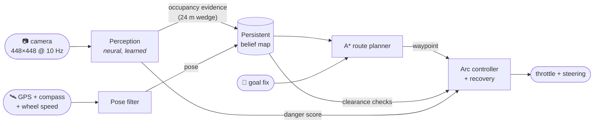
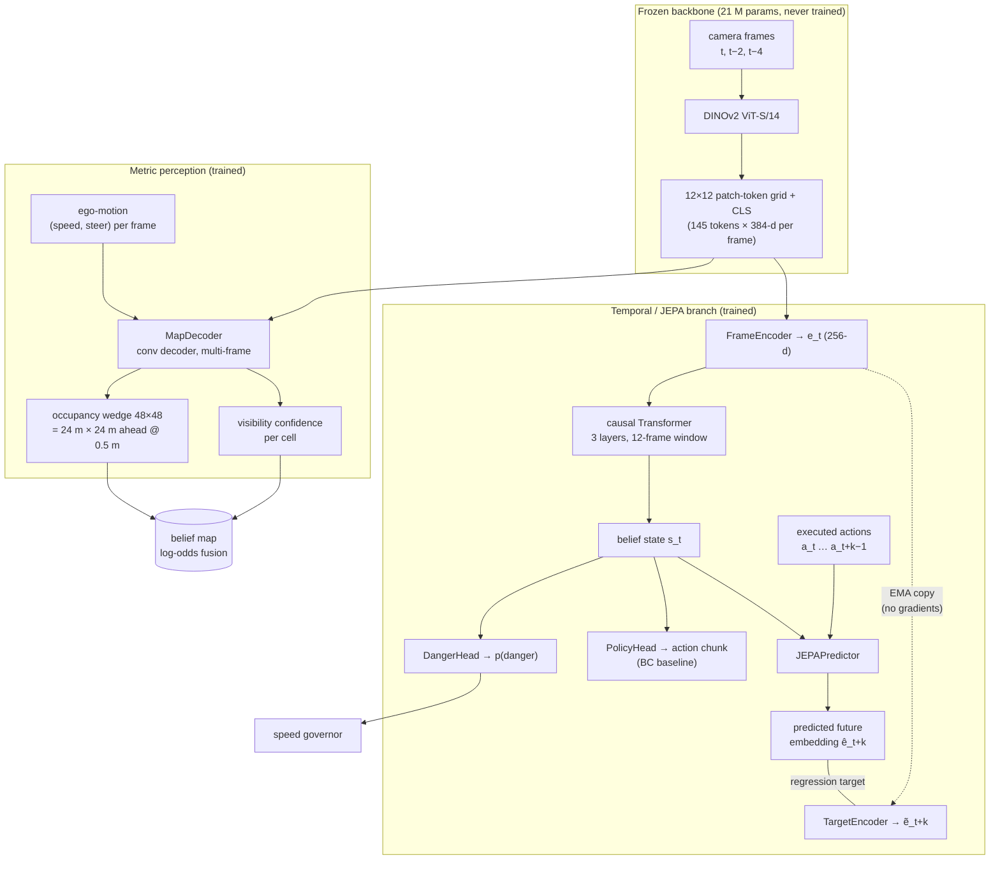
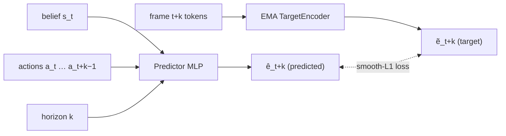
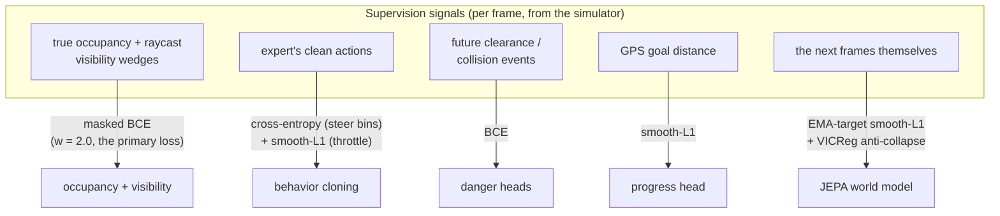
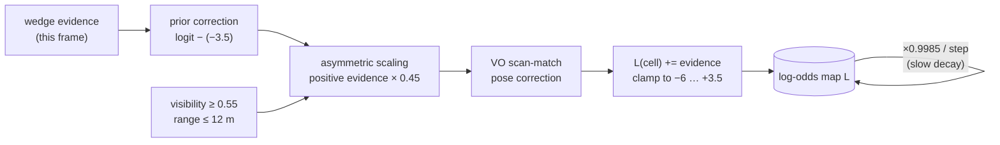
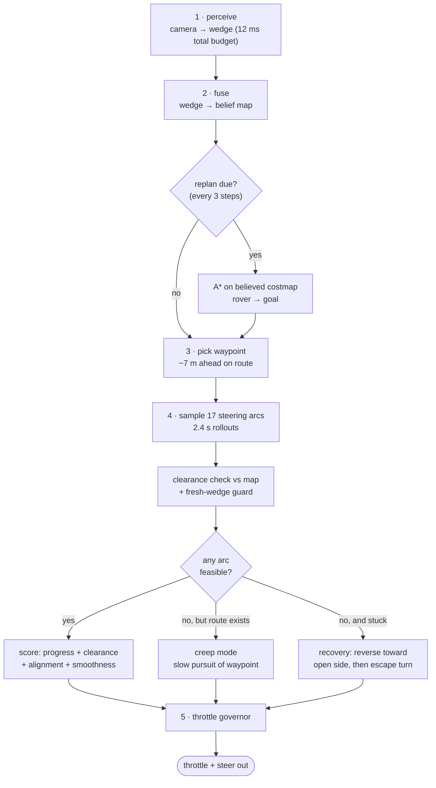
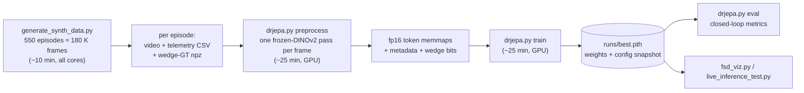

# DR-JEPA v10: Camera + Goal-Vector Autonomous Rover Navigation

DR-JEPA drives a rover to a GPS goal using **one forward camera and a goal
vector — nothing else**. No lidar, no depth sensor, no prior map.

It is not an end-to-end "pixels in, steering out" black box, and it is not
an action mimic. The core idea is that the model **builds an explicit,
persistent model of the world in its head** and navigation happens *on that
mental model*:

1. **Perceive** — a neural network converts each camera frame into metric
   evidence: *"which patches of ground in front of me are blocked?"*
2. **Remember** — that evidence is fused into a persistent bird's-eye map
   that covers the entire run and never forgets. An obstacle seen once
   stays known after it leaves the camera view.
3. **Plan** — a route to the goal is computed on the believed map and
   re-planned continuously as new evidence arrives.
4. **Act** — a local controller tracks the route, checking every candidate
   motion against the map, with recovery behaviors when boxed in.



**Headline results** (closed loop, unseen randomized worlds, ~100 m goals
through rocks / forests / walls / boulder fields):

| policy | success | SPL¹ | contact events/ep |
|---|---:|---:|---:|
| privileged expert (sees the true obstacle map) | ~98% | 0.94 | 0.3 |
| **DR-JEPA (camera + goal vector only)** | **100%** | **0.85–0.89** | ~2.0 |
| naive behavior cloning (previous architecture) | 62.5% | 0.44 | 6.5 |

¹ *SPL = success weighted by (straight-line distance / actual path length);
1.0 means every goal reached by a perfect path.*

Inference is **~12 ms per control step (83 Hz)** on an RTX 4080 — 8× faster
than the 10 Hz control loop needs. ~6.4 M trainable parameters on top of a
frozen DINOv2 backbone.

---

## Table of contents

- [How the model thinks](#how-the-model-thinks)
- [The architecture, piece by piece](#the-architecture-piece-by-piece)
- [What the model learns (training objectives)](#what-the-model-learns-training-objectives)
- [How the world is remembered (the belief map)](#how-the-world-is-remembered-the-belief-map)
- [How the actor drives](#how-the-actor-drives)
- [Why the danger score exists](#why-the-danger-score-exists)
- [The synthetic world and the expert teacher](#the-synthetic-world-and-the-expert-teacher)
- [Results in detail](#results-in-detail)
- [Quickstart](#quickstart)
- [Visualizations](#visualizations)
- [Configuration](#configuration)
- [Repository layout](#repository-layout)
- [Design history: what failed and why this design won](#design-history-what-failed-and-why-this-design-won)
- [Moving to real data](#moving-to-real-data)

---

## How the model thinks

A reactive policy (camera → action) has a fatal flaw for navigation: **the
moment an obstacle leaves the field of view it stops existing.** Such a
policy circles, re-explores, and drives into things it saw two seconds ago.
Our earlier behavior-cloning version did exactly that (62.5% success).

DR-JEPA instead separates *understanding* from *acting*:

- **Understanding is learned.** The hard, camera-specific problem —
  "convert pixels into metric geometry" — is solved by a neural network
  with dense supervision. This is where deep learning earns its keep.
- **Memory is exact.** Fusing geometry over time is a solved probability
  problem (Bayesian occupancy mapping), so it is done with math, not a
  network. The map cannot drift, collapse, or forget the way a recurrent
  latent state can, and it is unbounded: a 10-minute run costs the same
  per step as a 10-second one.
- **Acting is planned.** Given a believed map, finding a route is search
  (A*), not learning. The planner is *the same algorithm* the privileged
  expert uses on ground truth — so as perception approaches perfection,
  navigation provably approaches the expert's 100%.

This is why the system stopped hitting things: the ceiling of a plan-on-map
navigator is the quality of the map, not the compounding of per-step action
errors.

Every pixel of the [FSD-style visualization](#visualizations) is rendered
from this internal belief — the boxes, the free space, the route — never
from simulator ground truth. If a box appears there, it is because the
network put it in the map.

---

## The architecture, piece by piece



### Frozen DINOv2 backbone — *the sim-to-real anchor*

Every frame passes through DINOv2 ViT-S/14, a vision transformer pretrained
by Meta on 142 M real images. It is **completely frozen**, for two reasons:

1. **Transfer.** Its features already describe real-world texture, depth
   cues, and object boundaries. Everything trainable sits *behind* these
   features, so a model trained on synthetic renders stays anchored to a
   representation that works on real footage.
2. **Speed.** Frozen backbone ⇒ features can be precomputed once during
   dataset packing. Training then never touches pixels and a full training
   run takes ~25 minutes on one GPU.

The 32×32 patch grid (448 px input) is average-pooled to **12×12 + CLS =
145 tokens** per frame — fine enough for metric geometry, small enough to
store (fp16 memmaps).

### MapDecoder — *the eyes*

The perception head answers one question per frame: *for each 0.5 m cell in
the 24 m × 24 m area ahead, is it blocked?* Two design details matter:

- **Multi-frame input with ego-motion.** The decoder sees the tokens of
  frames *t, t−2, t−4* stacked per grid position, plus each frame's speed
  and steering. Three views of the same rock from slightly different
  positions give **motion parallax** — the strongest monocular depth cue —
  so ranging does not rely on texture size alone.
- **A visibility head.** The network also predicts *which cells it can
  actually see* (the field-of-view cone minus occlusion shadows). It is
  trained with occlusion-aware raycast masks, so it is never punished for
  not knowing what is behind a rock — and at fusion time, low-confidence
  cells simply do not write into the map. This keeps the map free of
  hallucinated geometry.

Output orientation matters more than it looks: the conv output is re-indexed
(flip + transpose) so image axes map *locally* onto wedge axes. Conv kernels
can learn a perspective warp; they cannot learn a global transpose — this
single bug once held occupancy IoU at 0.06.

### FrameEncoder + causal Transformer — *the gut feeling*

In parallel, each frame's tokens are compressed to a 256-d embedding
`e_t`, and a small causal transformer over the last 12 embeddings (1.2 s)
produces a **belief state** `s_t`. This branch captures dynamics — am I
moving, sliding, about to clip something — that a single frame can't. The
causal mask guarantees training-time beliefs match what streaming inference
can compute.

### JEPAPredictor — *the imagination*

This is the JEPA (Joint-Embedding Predictive Architecture) core. Given the
belief `s_t` **and the actions actually executed**, it must predict the
frame embedding k steps in the future (k ∈ {1, 4, 8} ≈ 0.1–0.8 s):



Why predict *embeddings* rather than pixels? Pixel prediction wastes
capacity on irrelevant detail (exact grass texture); embedding prediction
forces the representation to keep exactly what is *predictable and
controllable* about the scene — geometry, heading, closing distances. Why
condition on actions? Because then the predictor is a small **world model**:
"if I steered left for 0.8 s, what would I see?" Two safeguards prevent the
classic collapse to a constant embedding: the regression target comes from a
slow **EMA copy** of the encoder (not the online one), and VICReg-style
variance/covariance regularization keeps embedding dimensions informative
and decorrelated.

At inference the predictor doubles as a *latent safety shield* for the BC
pilot: candidate action chunks are rolled through it and a danger head
scores the imagined outcomes.

### The heads

| head | input | output | role at inference |
|---|---|---|---|
| MapDecoder | frame tokens ×3 + ego-motion | occupancy + visibility wedge | **builds the map — primary** |
| DangerHead | belief `s_t` | p(trouble within 1 s) | caps speed near hazards |
| PolicyHead | belief `s_t` + goal vector | 8-step action chunk | BC baseline / fallback pilot |
| FutureDangerHead | (predicted) embedding | p(danger at t+k) | scores imagined futures |
| ProgressHead | embedding delta + goal ctx | Δ goal-distance | scores imagined futures |

The PolicyHead classifies steering over **15 discrete bins** instead of
regressing a scalar. Obstacle dodging is *multimodal* — swerving left or
right are both correct — and a regression averages the two modes into
"drive straight at the rock." Classification keeps the modes; argmax
decoding commits to one.

---

## What the model learns (training objectives)

All heads train jointly, from data logged by a scripted expert driving in
the simulator (next section). One batch = windows of 20 consecutive frames.



Details that matter:

- **Occupancy loss is masked by visibility** and weighted toward near rows
  (1.6× at 0 m fading to 0.7× at 16 m); cells beyond 16 m are not
  supervised at all — monocular ranging past that is noise, and training on
  noise pollutes calibration. The map accumulates the far field naturally
  as the rover approaches.
- **Checkpoint selection uses validation *map* loss only.** The BC heads
  overfit far earlier than perception; letting them vote once selected a
  visibly worse mapper.
- **JEPA conditions on *executed* actions** (which may include injected
  noise), not the expert's clean labels — the executed actions are what
  actually caused the transitions being predicted.
- Occupancy positive class weight is mild (1.5): fusion handles the base
  rate (below), and inflating positives fattens the false-positive tail
  that pollutes maps.

---

## How the world is remembered (the belief map)

The rover's long-term memory is a **512×512-cell log-odds occupancy grid**
(0.5 m cells ≈ 256 m × 256 m), anchored to the world frame, re-centering
itself if the rover drives near its edge. It is the "ever-growing, permanent
context": O(1) cost per step, unlimited duration.



Each stage exists because a failure mode demanded it:

- **Prior correction** — occupancy's base rate is ~2%, so a *calibrated*
  network's decision boundary sits at logit ≈ −3.5, not 0. A prediction of
  p = 0.3 is *ten times the base rate* — strong evidence FOR an obstacle —
  yet naive fusion (`L += logit`) would count it as evidence of free space.
  Bayesian updating subtracts the prior: `evidence = logit − prior`. Fixing
  this took closed-loop success from 75% → 100%.
- **Asymmetric scaling + decay + positive clamp** — per-frame false
  positives are *correlated* (a terrain ridge misread once is misread every
  frame), which breaks naive fusion's independence assumption and once
  grew phantom walls until worlds looked sealed shut. Positive evidence
  accumulates slower than free-space evidence, phantom mass decays
  (~46 s half-life) unless re-confirmed, and occupied belief saturates
  below free belief so it stays revisable.
- **Visual-odometry alignment** — GPS drifts, so a wedge painted now can
  land ~1 m off the same obstacle painted a minute ago, smearing the map.
  Before fusing, the new wedge is scan-matched (±1 m search) against
  already-established map structure, and the residual nudges the pose
  filter. GPS still anchors the absolute frame; VO removes the relative
  drift *between* observations. (`--no_vo` disables it.)
- **The fresh-wedge guard** — the newest wedge is in the rover's own frame
  and therefore immune to pose error. The controller checks arcs against
  *both* the fused map and this zero-lag near-field guard.

Pose itself comes from a complementary filter: integrate wheel-speed ×
compass heading for smooth short-term motion, pull gently toward GPS
(gain 0.08/step) to bound long-term drift.

---

## How the actor drives

Every 100 ms control step:



- **The global planner** runs weighted A* over a costmap derived from the
  map: cost rises smoothly with occupancy probability and with proximity to
  believed obstacles (distance-transform inflation); unknown space costs
  slightly more than known-free (mild exploration preference); cells within
  ~0.9 m of believed obstacles are lethal. If the map claims *no* route
  exists, the planner retries with a slimmer lethal radius — the map can be
  wrong; the planner must not deadlock.
- **The local controller** is the same arc-sampling recipe the privileged
  expert uses — 17 constant-curvature arcs, scored by waypoint progress,
  clearance, heading alignment, and steering smoothness — except every
  clearance lookup goes through the *believed* map instead of ground truth.
- **Creep mode** resolves a deadlock the two layers can create: in a tight
  gap the conservative arc check may reject everything while A* correctly
  insists the corridor is passable. Instead of thrashing into recovery, the
  rover creeps along the route at low speed; genuine stuck-ness (no motion
  while commanding forward) still triggers recovery.
- **Recovery** mirrors the expert: reverse toward the more open side; if
  reversing is also blocked, alternate with a slow forward escape turn.
- **The throttle governor** takes the *minimum* of several caps: arc
  clearance, turn sharpness, goal proximity, gap width ahead (from the
  fresh wedge — tight gaps are threaded slowly, because with 200 ms
  actuation latency, speed is what turns a near-miss into a graze), and the
  learned danger score.

---

## Why the danger score exists

The map is geometry; the danger head is a *learned reflex* on top of the
temporal belief state, trained to predict whether clearance will drop below
~1.8 m (or contact will occur) within the next second.

It earns its place three ways:

1. **It sees what the map abstracts away.** The belief state carries
   dynamics — current speed, slide, an obstacle rushing the camera — so the
   danger score spikes in situations where static geometry alone looks
   tolerable.
2. **It is a redundant, differently-derived safety channel.** The map path
   can be wrong (pose smear, missed detection); the danger head is computed
   from the raw visual stream by a different network path, and it caps
   throttle independently of the planner.
3. **Its sibling scores imagined futures.** The FutureDangerHead evaluates
   *predicted* embeddings from the JEPA world model, which is what lets the
   BC pilot screen candidate action chunks through imagination ("if I did
   this, would things get dangerous?") without any extra sensors.

You can watch it work in every visualization — the HAZARD bar and the red
vignette pulse are this head firing.

---

## The synthetic world and the expert teacher

Training data comes from a domain-randomized simulator
(`drjepa/simulator.py`) engineered so that *nothing the model relies on is
sim-specific*:

- **Geometry & terrain hazards:** gridded heightfield with rolling relief,
  **carved washes/gullies** (steep, often un-climbable banks), **steep
  mounds**, and **sand fields** that visually recolor the ground and
  physically sap traction. Camera pitch/roll follows the ground. Crossing
  too steep a side-slope tips the rover (terminal); grades past the climb
  limit stall it. Irregular jittered-mesh rocks/trees/bushes, four scenario
  types (open scatter, dense forest, walls with gaps, boulder fields) plus
  u-turn and stuck-recovery spawns.
- **Appearance randomized per episode:** sun direction and intensity, sky
  palette, ground/rock/vegetation palettes, fog density, exposure and
  white-balance, vignette, sensor noise, motion blur, ride-bump camera
  shake.
- **Physics:** acceleration limits, steering lag, 200 ms actuation latency,
  wheel slip, and contact with **tangential sliding** (a rover wedged
  against a rock scrapes past it rather than freezing — without this,
  wedges between boulders were unescapable).
- **Sensors:** the logs contain only what a real rover would have — GPS
  with bounded random-walk bias, compass with bias + noise, noisy wheel
  speed. Ground truth (true pose, occupancy wedges with raycast visibility)
  is logged *separately, for training labels only*.

The **teacher** is a privileged two-layer autonomy stack: A* over the true
obstacle map + the arc controller (`drjepa/expert.py`). It scores ~98%
success / SPL 0.94 and provides clean action labels. During logging, the
*executed* commands are occasionally noise-perturbed while labels stay
clean, so the dataset covers off-route states with corrective supervision.
`--scenario` forces one scenario type; `--dagger ckpt` makes the *model*
drive while the expert labels (DAgger).



---

## Results in detail

### v10: terrain-hazard worlds (washes, steep grades, soft sand)

v10 rebuilt the simulator around Hanksville-class terrain hazards -- carved
washes with un-climbable banks, steep mounds, sand that saps traction, and
real failure physics (tip-over is terminal, steep grades stall) -- and
extended perception to a four-channel wedge (occupancy, visibility,
**elevation**, **soft ground**). Pooled over 110 unseen worlds:

| metric | expert (privileged) | DR-JEPA v10 |
|---|---:|---:|
| success rate | 100% | **91%** |
| tipped episodes | 0% | 6% |
| SPL | 0.92–0.97 | 0.76 |
| contact events / episode | 0.03 | 2.1 |

For calibration: earlier versions had *no concept* of these hazards -- on
v10 worlds they would drive straight into the first wash. Elevation is
predicted to ~4 cm mean error where visible; sand classification is
near-perfect (it is a strong visual cue by design). One fusion lesson made
the difference between 60% and 90% success: terrain-hazard lethality must
be computed from gradients **inside a single wedge** (self-consistent) and
fused as its own log-odds channel -- gradients across the fused elevation
map's frame-to-frame seams are pose-drift artifacts that once built
phantom lethal walls.

### v9 flat-world results (obstacles only, for reference)

| metric | expert (privileged) | DR-JEPA v9 | BC pilot (v7) |
|---|---:|---:|---:|
| success rate | 96.7% | **100%** | 62.5% |
| SPL | 0.94 | **0.889** | 0.44 |
| contact events / episode | 0.23 | **1.87** | 6.5 |

### Map-space JEPA (completion): what we measured, honestly

The MapCompleter genuinely anticipates hidden map content (hidden-cell
occupancy **AUC 0.745**, hazard **AUC 0.800** on validation) and drives the
violet ghost layer in the visualizer. Feeding its predictions into the
planner's costs, however, measured **neutral-to-slightly-negative** in
closed loop across three integration variants and 110 episodes per arm
(-3 pts success, -0.05 SPL): the wall-continuation prior also paints over
the unseen *gap* the rover should probe -- an anti-exploratory failure that
outweighs the tip-protection it provides near unseen wash banks. Planner
integration therefore defaults OFF (`--complete` to enable); the trained
head remains for visualization, analysis, and future information-gain
planning that reasons about prediction *uncertainty* rather than raw cost.

---

## Quickstart

```bash
python3.12 -m venv .venv
.venv/bin/pip install torch torchvision opencv-python pandas numpy tqdm
source .venv/bin/activate
```

```bash
# 1 · generate the dataset (video + telemetry + wedge ground truth)
python generate_synth_data.py --episodes 400 --output data_v10
python generate_synth_data.py --episodes 150 --output data_v10_wall --scenario wall --seed 50000

# 2 · pack: run every frame through frozen DINOv2 once
python drjepa.py preprocess --data_dir data_v10,data_v10_wall --output packed

# 3 · train
python drjepa.py train --dataset packed --save_dir runs

# 4 · closed-loop evaluation (records show the live belief map + route)
python drjepa.py eval --policy model --pilot map --checkpoint runs/best.pth --episodes 40 --record 4
python drjepa.py eval --policy expert --episodes 40          # privileged upper bound
python drjepa.py eval --policy model --pilot bc  ...         # BC ablation
python drjepa.py eval ... --no_vo                            # VO ablation

# 5 · watch it drive
python live_inference_test.py --checkpoint runs/best.pth     # endless run + HUD
python fsd_viz.py --checkpoint runs/best.pth --frames 900    # cinematic belief view
python drjepa.py viz --video data_v10/<episode>.mp4 --checkpoint runs/best.pth
```

---

## Visualizations

- **`fsd_viz.py`** — the Tesla-FSD-style cinematic view. A chase camera in
  the *belief world*: detected obstacles rise as glowing boxes, explored
  ground is shaded, the A* route flows ahead as an animated ribbon, the
  goal is a light beacon. Insets: live camera, the raw neural occupancy
  wedge, the full-run memory map, drive telemetry. 30 fps output (3×
  tweening between control steps); renders ~2× faster than real time at
  full quality. `--tweens 1 --width 960 --height 540 --show` for a fast
  live preview.
- **`live_inference_test.py`** — the endless closed-loop demo with a
  compact HUD and the memory-map inset; new goals spawn forever.
- **`drjepa.py eval --record N`** — evaluation episodes recorded with HUD
  + belief-map inset (what the reported metrics look like).
- **`drjepa.py viz`** — open-loop: model outputs vs logged human/expert
  actions over a recorded episode.

---

## Configuration

Everything lives in `drjepa/config.py`, grouped into `SimConfig` (world,
physics, sensors, render size), `ModelConfig` (architecture), and
`TrainConfig` (schedule + loss weights). Checkpoints embed a full config
snapshot, so inference always rebuilds the exact trained architecture.

Knobs most worth knowing:

| knob | default | effect |
|---|---|---|
| `ModelConfig.img_size` | 448 | DINOv2 input (multiple of 14). Sharper perception ↔ speed. Re-run `preprocess` after changing. |
| `SimConfig.img_w/img_h` | 448 | render size; keep ≥ `img_size` or the extra input resolution buys nothing |
| `ModelConfig.frame_offsets` | (0, 2, 4) | multi-frame perception lookbacks |
| `ModelConfig.wedge_range_cells` | 32 (=16 m) | supervised / trusted perception range |
| `ModelConfig.jepa_offsets` | (1, 4, 8) | world-model prediction horizons |
| `TrainConfig.w_map` | 2.0 | occupancy loss weight (the primary task) |
| `MapPilot.PRIOR_LOGIT` | −3.5 | occupancy base-rate prior used in fusion |

---

## Repository layout

```
drjepa/config.py         every hyperparameter (sim · model · training)
drjepa/simulator.py      domain-randomized world, physics, sensors, wedge GT
drjepa/expert.py         privileged A* + arc-planner teacher
drjepa/model.py          RoverJEPA: MapDecoder, JEPA world model, heads
drjepa/dataset.py        feature packing + training dataset
drjepa/pilot.py          MapPilot (perceive→map→plan→act), BC Pilot, HUD
drjepa.py                CLI: preprocess / train / eval / viz
generate_synth_data.py   episode generator (--scenario, --dagger)
live_inference_test.py   endless closed-loop demo
fsd_viz.py               cinematic belief-world visualization
```

---

## Design history: what failed and why this design won

The architecture was reached by measurement, not aesthetics. The short
version, in case you are tempted to retrace it:

1. **Steering must be classified, not regressed.** Dodging is multimodal;
   regression averaged "left or right" into "straight into the rock"
   (22.5% → 47.5% success).
2. **Commitment beats reactivity.** Executing a few steps of each planned
   chunk with steering hysteresis stopped per-step dodge flip-flopping
   (47.5% → 57.5%).
3. **DAgger hurt here.** Corrective "struggle" data made the BC policy
   timid; clean expert demonstrations won (documented ablations).
4. **Reactive policies cap out.** Even the best BC pilot circled and
   ground against obstacles it could no longer see — the ceiling was the
   architecture, not the data. The map + planner redesign took the same
   perception budget from 62.5% to 100% success.
5. **Fusion math is not a detail.** The prior-correction fix alone was
   worth 25 points of success rate; the anti-phantom measures another 10.
6. **Perception is no longer the bottleneck** — pose error and actuation
   latency are. The oracle-perception ablation (`OraclePilot` pattern:
   subclass `MapPilot`, override `_perceive`) is the diagnostic that
   separates the two, and the most useful debugging tool in the repo.

---

## Moving to real data

The pipeline is format-compatible with real logs: (video, CSV) pairs with
the same telemetry columns train the JEPA/danger/policy heads directly —
`preprocess` skips map supervision gracefully when the wedge `.npz` is
absent. Training the perception head on real footage needs a geometry
source *at collection time only* (stereo/depth camera or lidar auto-labels
the wedges; deploy stays camera-only), plus one depth→wedge conversion
script. Co-train real and sim data by passing multiple directories to
`--data_dir`. The frozen DINOv2 backbone is the transfer anchor — only the
small heads need to adapt.
